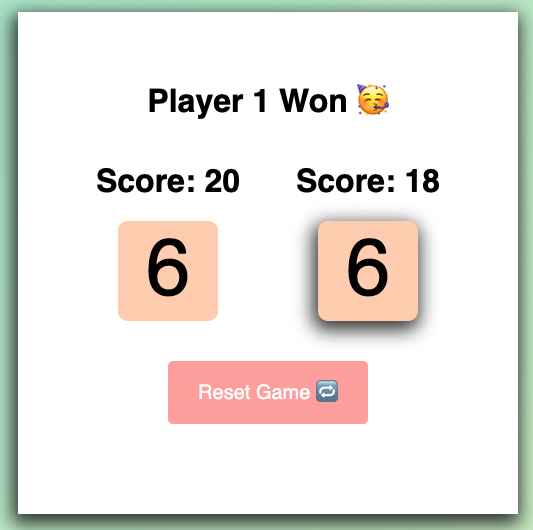

# Dice Game

A project from the [Scrimba Frontend Developer Career Path](https://scrimba.com/learn/frontend)

## Table of Contents

- [Overview](#overview)
  - [Requirements](#requirements)
  - [Screenshots](#screenshots)
  - [Links](#links)
  - [Built with](#built-with)
- [Future Goals](#future-goals)

## Overview

### Requirements

- [x] Visually show which player's turn it is
- [x] Keep a scoreboard
- [x] Roll Dice/Reset Game Buttons (hide/display)
- [x] Announce winner when a player is at or over 20

### Screenshots

### Links

- Live Site URL: [GitHub Pages](https://xchristinawu.github.io/dice-game/)

### Built with

- HTML, CSS, JavaScript

## Future Goals
- Add more gambling aspects (double or nothing button)
- Make the game fair (dice roll to determine which player goes first)
- Add animations
- Change numbers to image of dice

